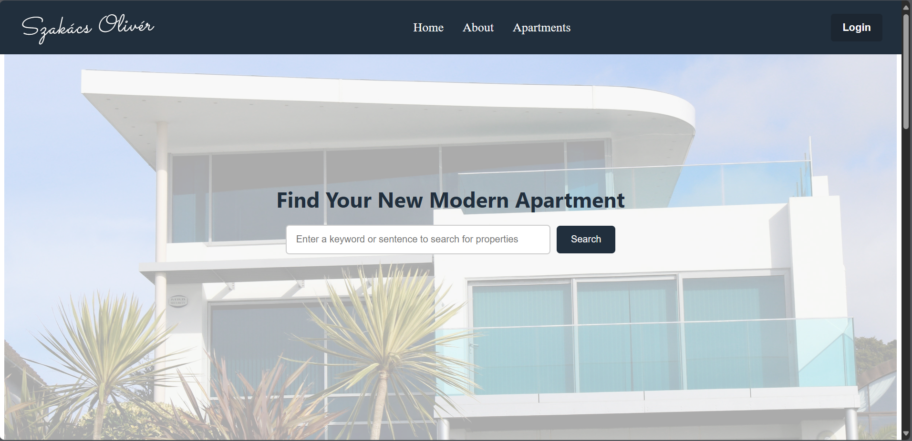
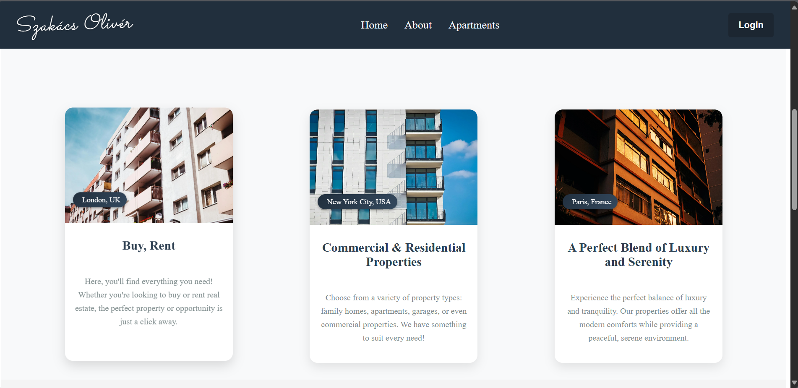

# Albérlet Bérlő/Vásárló Alkalmazás - Önálló Laboratóriumi Projekt 

## Projekt Leírás - folyamatban

Ez a projekt egy teljes értékű **full-stack albérlet bérlő/vásárló alkalmazás**, amely lehetővé teszi a felhasználók számára az albérletek keresését, szűrését, hirdetések létrehozását, valamint a bérlők és eladók közötti kapcsolat felvételét. Az alkalmazás biztosítja a bérlők számára a lehetőséget, hogy kapcsolatba lépjenek a hirdetők (albérlet tulajdonosok) és egyszerűsíti az albérletpiac kezelését.

## Használt Technológiák

- **Frontend**: React
- **Backend**: Spring Boot
- **Adatbázis**: MySQL
- **AI**: Használatban van egy mesterséges intelligencia komponens, amely segít az albérlet hirdetések kategorizálásában és ajánlásában, valamint a keresési találatok finomításában a felhasználói preferenciák alapján.
- **Autentikáció**: **Keycloak** - a felhasználók hitelesítésére és jogosultságkezelésére.

### Backend Fejlesztés

- **Spring Boot** alapú REST API fejlesztés.
- **MySQL** adatbázis kezelés a bérletek és felhasználók adatainak tárolására.
- **Biztonság**: **Keycloak** autentikációs rendszer használata a felhasználók hitelesítésére és jogosultságkezelésére. JWT (JSON Web Tokens) alapú hitelesítés és jogosultságkezelés.

### Frontend Fejlesztés

- **React** alapú felhasználói felület.
- **Axios** használata HTTP kérések kezelésére a backenddel való kommunikációhoz.
- **React Router** az oldalak közötti navigációhoz.

##Képernyőképek

